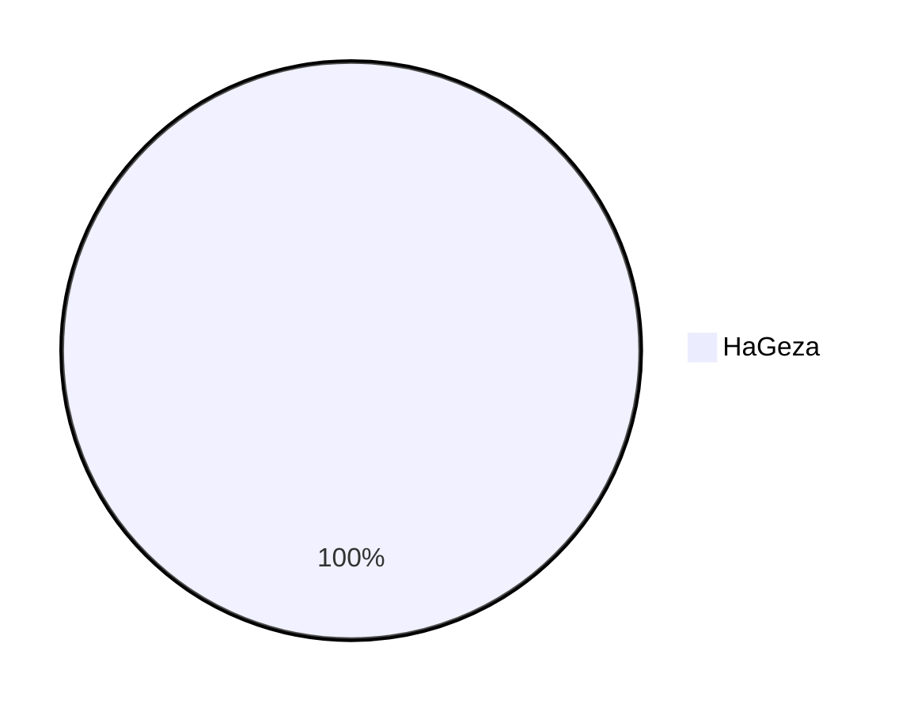

See [proportion of commits by authors](#proportion-of-commits-by-authors) generated by [GHCPR](https://github.com/HaGeza/GHCPR)
<!-- Generated by GHCPR -->
# GitHub Commit Proportion Reporter (GHCPR)

This is a GitHub action, that creates a plot based on the proportion of commits on the current branch made by each user, adds it to the specified file (`README.md` by default), ammends the commit, and pushes the changes.

The main use-case for this tool are repos with log-normal-like commit-proportion-distributions 😉.

<!-- Generated by GHCPR -->
### Proportion of commits by authors

